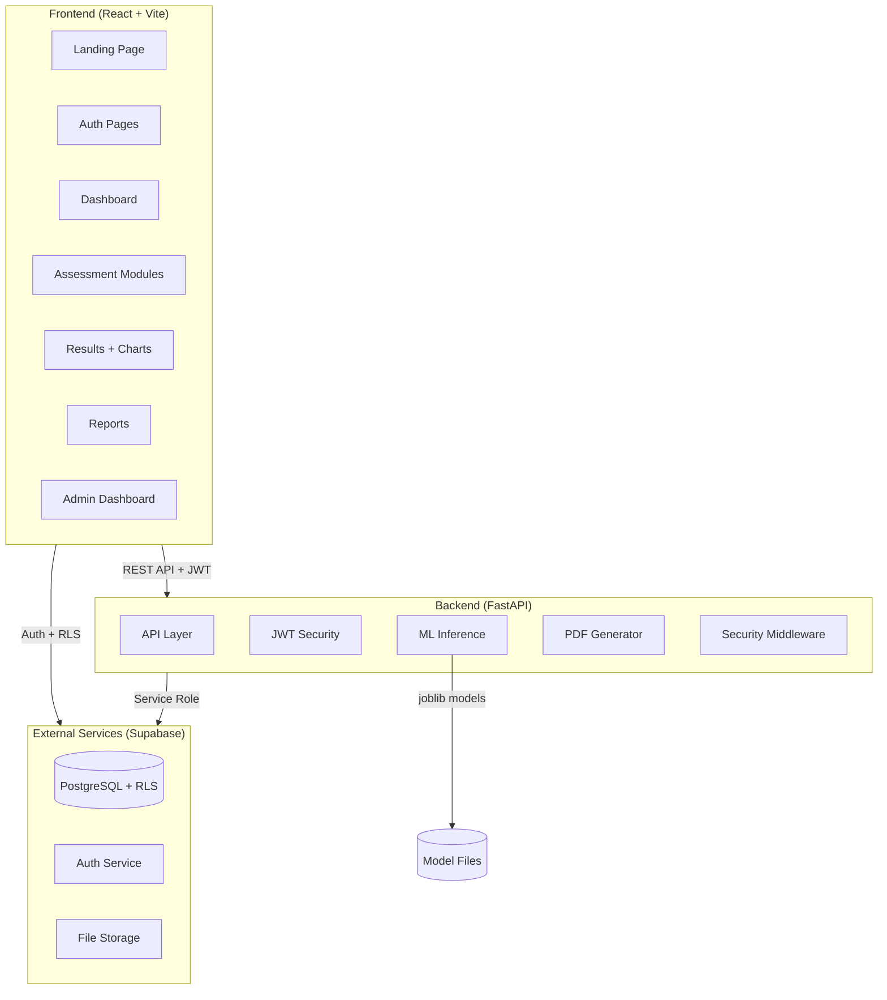
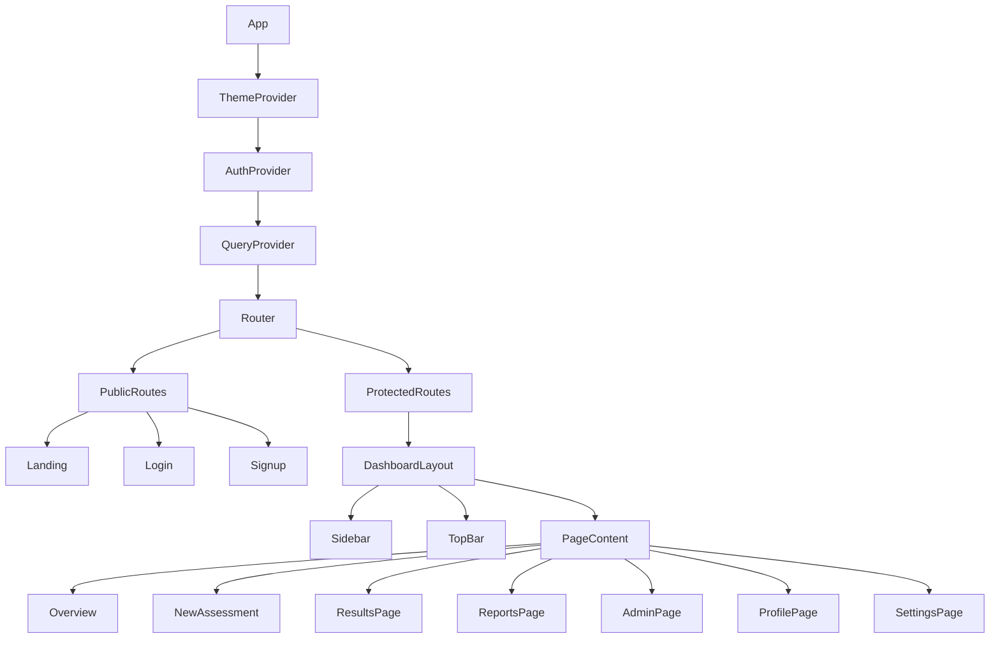
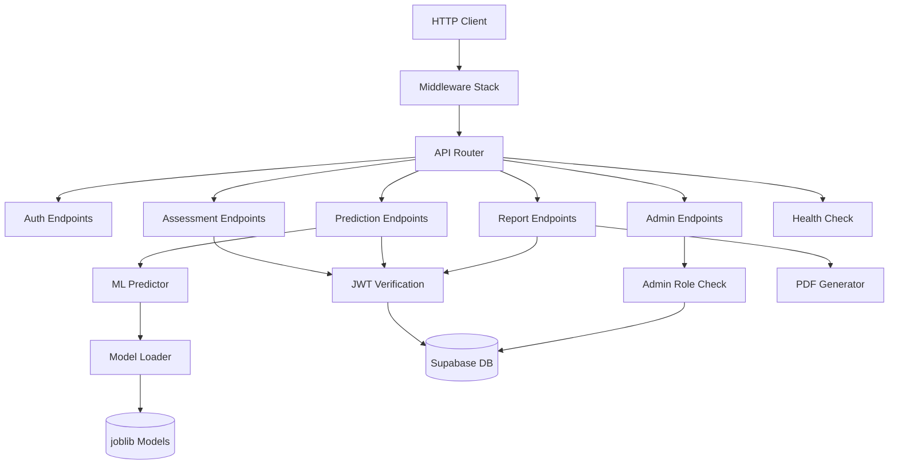
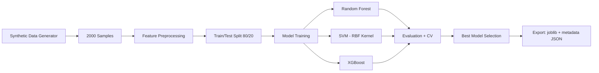
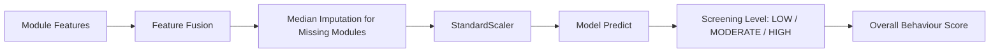
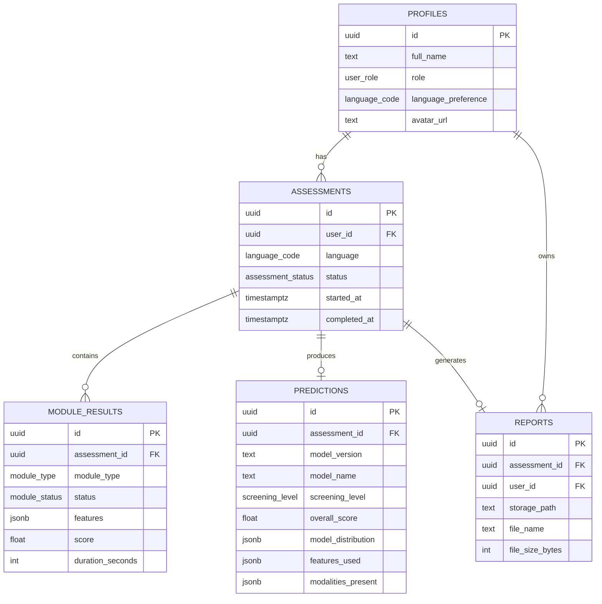
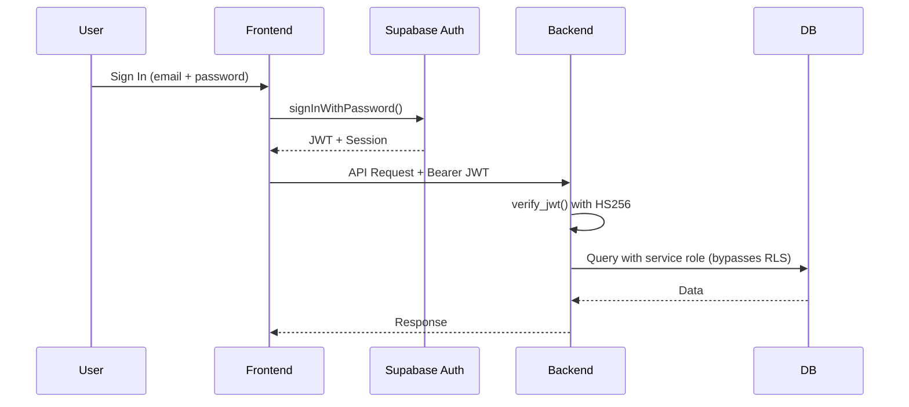
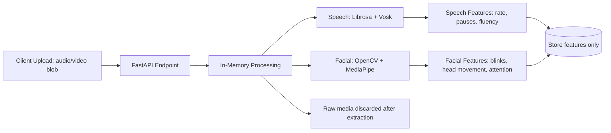
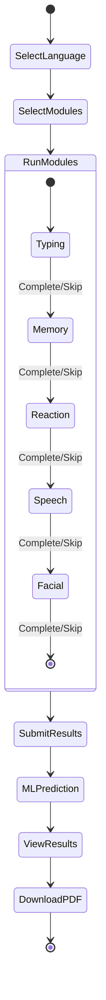
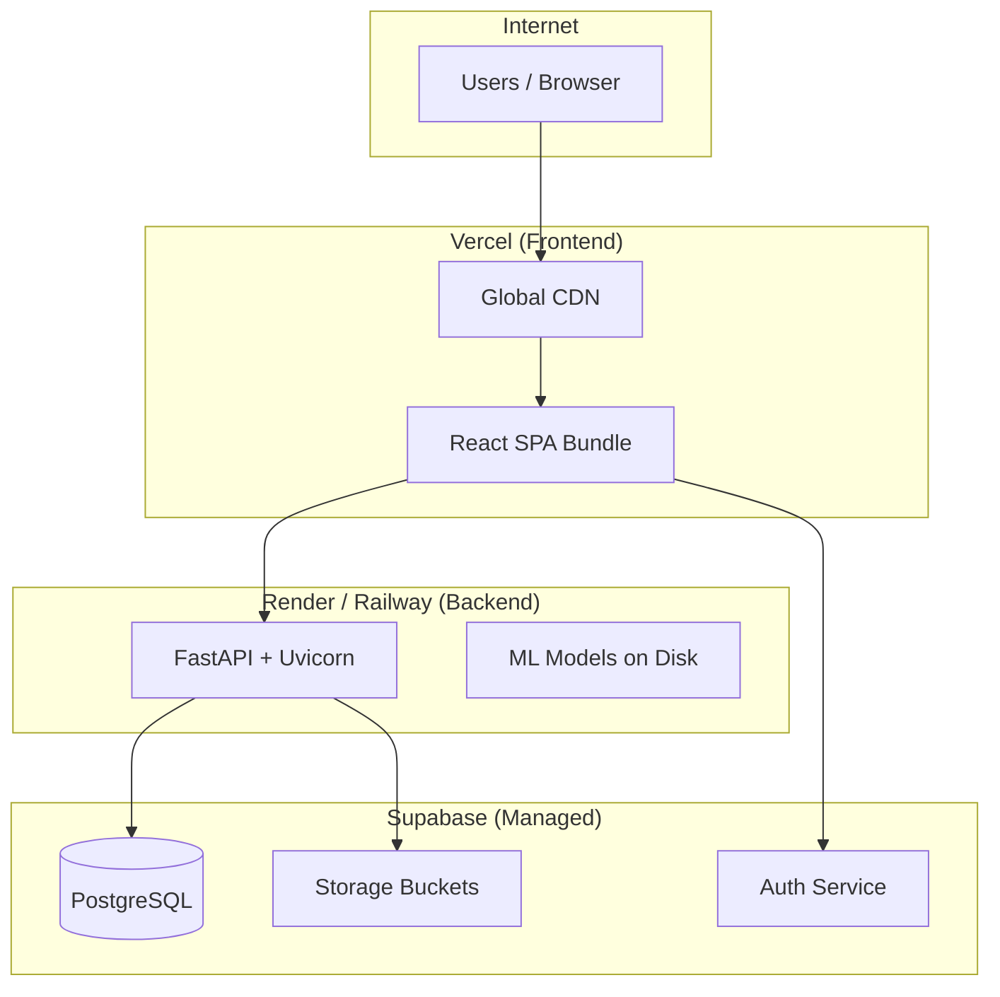

# NeuroScreen — System Architecture

> ⚠️ **Disclaimer:** This application is intended for behavioural screening and educational/research purposes only. It is NOT a medical diagnosis.

> ⚠️ **Research/Educational Prototype** — trained and evaluated on synthetic data. Not clinically validated.

---

## 1. System Overview

NeuroScreen is a modular monolith consisting of three main components:

---

## 2. Frontend Architecture

### Technology Stack
- **React 19** with TypeScript
- **Vite 8** for build tooling
- **Tailwind CSS 4** + shadcn/ui for styling
- **Framer Motion** for animations
- **Recharts** for data visualization
- **TanStack Query** for server state management
- **React Router** for client-side routing
- **Axios** for HTTP requests with JWT injection

### Component Hierarchy

### State Management
- **Auth state**: React Context (`AuthProvider`) wrapping Supabase Auth
- **Server state**: TanStack Query with stale-time caching
- **UI state**: Component-local `useState`
- **Theme**: `next-themes` for dark/light mode persistence

### API Client
All API calls go through a shared Axios instance (`services/api.ts`) that:
1. Reads the JWT from Supabase Auth session
2. Attaches `Authorization: Bearer <token>` header
3. Auto-refreshes expired tokens via response interceptor
4. Retries the original request with the new token

---

## 3. Backend Architecture

### Technology Stack
- **FastAPI** (Python 3.11+)
- **Pydantic v2** for request/response validation
- **python-jose** for JWT verification
- **Supabase Python SDK** for database access
- **ReportLab** for PDF generation

### Layered Architecture

### Middleware Stack (order of execution)
1. **RequestIDMiddleware** — Adds unique `X-Request-ID` for tracing
2. **SecurityHeadersMiddleware** — CSP, X-Frame-Options, HSTS, etc.
3. **RequestLoggingMiddleware** — Logs method, path, status, duration
4. **CORSMiddleware** — Cross-origin request handling

### API Endpoints

| Prefix | Auth | Description |
|--------|------|-------------|
| `/api/health` | Public | Health check |
| `/api/auth` | Public | Auth helpers (profile sync) |
| `/api/assessments` | JWT | Assessment CRUD + module results |
| `/api/predictions` | JWT | ML predictions + history |
| `/api/reports` | JWT | PDF generation + download |
| `/api/admin` | Admin | Dashboard stats, users, model info |

---

## 4. ML Pipeline Architecture

### Offline Pipeline (Training)

### Online Pipeline (Inference)

### Feature Schema
- **22 behavioural features** from 5 modules
- **5 modality-present indicators** (binary flags)
- **27 total input features** to the ML model
- Missing modules → median imputation from training data + indicator = 0

---

## 5. Database Architecture

### Entity Relationship

### Row Level Security (RLS)
All tables have RLS enabled. Key policies:
- **profiles**: Users can read/update only their own profile
- **assessments**: Users can CRUD only their own assessments
- **module_results**: Access tied to assessment ownership
- **predictions**: Read-only access for assessment owner
- **reports**: Users can read only their own reports

---

## 6. Security Architecture

### Authentication Flow

### Security Layers
1. **Transport**: HTTPS enforced (HSTS in production)
2. **Authentication**: Supabase-issued JWT verified via HS256
3. **Authorization**: Role-based (USER / ADMIN) checked at endpoint level
4. **Data Access**: PostgreSQL RLS as secondary defense
5. **Response Headers**: CSP, X-Frame-Options, X-Content-Type-Options
6. **Request Tracing**: X-Request-ID for audit trails
7. **Production Hardening**: OpenAPI docs disabled, explicit CORS origins

---

## 7. Media Pipeline

### Design Principle
**No raw media is ever stored.** Audio and video are processed transiently in-memory.

---

## 8. Assessment Flow

---

## 9. Deployment Architecture

