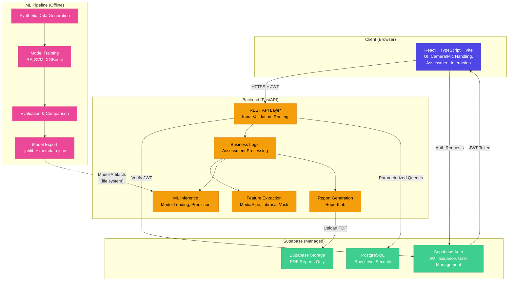
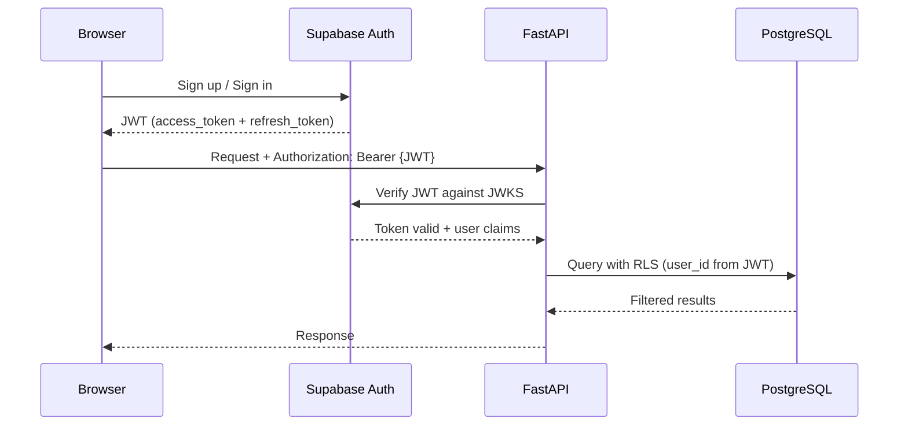
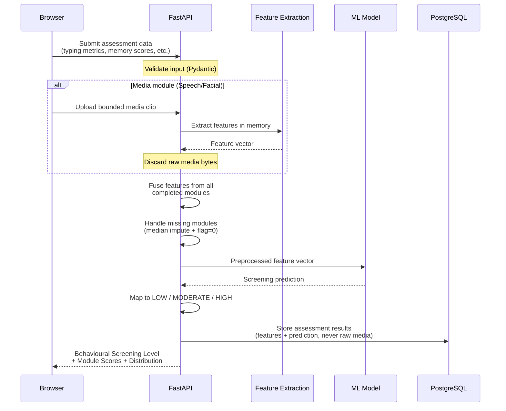
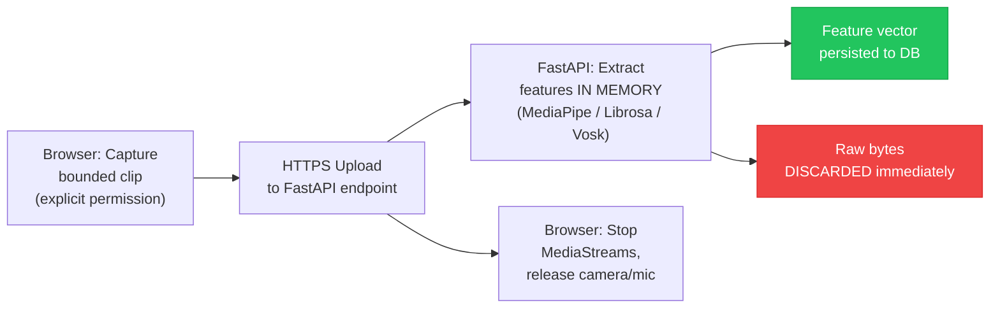
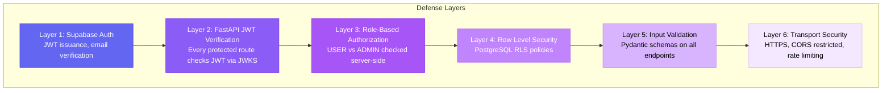
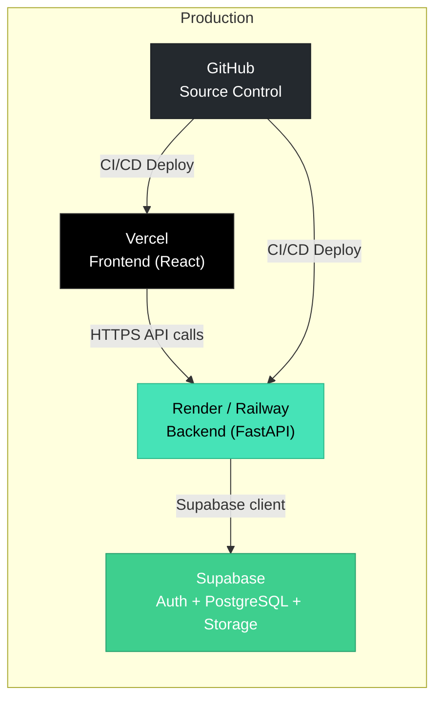

# NeuroScreen — Architecture Overview

> **Research/Educational Prototype** — trained and evaluated on synthetic data. Not clinically validated.

---

## 1. System Architecture

NeuroScreen follows a **modular monolith** architecture. All backend logic runs in a single FastAPI process. The ML pipeline is offline (scripts/notebooks), not a live service.

### Why Modular Monolith?

- This is an educational/research project — microservices add deployment and observability complexity with no benefit at this scale
- A single FastAPI process simplifies deployment, debugging, and testing
- The ML layer is decoupled by design — it runs offline and exports artifacts consumed by the backend

---

## 2. Component Diagram

---

## 3. Data Flow

### 3.1 Authentication Flow

### 3.2 Assessment & Prediction Flow

### 3.3 Media Pipeline (Section 6 Compliance)

---

## 4. Technology Justification

| Technology | Purpose | Why Chosen | Alternative Considered |
|---|---|---|---|
| **React + Vite** | Frontend framework | Fast HMR, TypeScript-first, large ecosystem | Next.js — SSR not needed for this SPA |
| **Tailwind CSS + shadcn/ui** | Styling | Utility-first + accessible components, consistent design system | Plain CSS — less productive for complex UIs |
| **Recharts** | Data visualization | Native React components, declarative API, covers all chart types needed | Chart.js — requires wrapper, imperative config |
| **FastAPI** | Backend API | Async Python, auto OpenAPI docs, Pydantic validation, ML ecosystem | Flask — no async, no auto-docs, manual validation |
| **Supabase** | Auth + DB + Storage | Managed PostgreSQL + Auth + RLS + Storage in one service | Firebase — less SQL flexibility; self-hosted Postgres — more ops burden |
| **scikit-learn + XGBoost** | ML models | Industry standard for classical ML, well-documented, Joblib export | Deep learning — overkill for tabular features, less explainable |
| **Vosk** | Speech-to-text | Offline, privacy-preserving, supports English + Kannada, no API keys | Whisper — heavier model, requires GPU/more RAM |
| **MediaPipe Face Mesh** | Facial feature extraction | Lightweight, well-documented, 468 landmarks, works on CPU | dlib — fewer landmarks, slower |
| **Librosa** | Audio feature extraction | Standard Python audio analysis library, extensive feature set | torchaudio — heavier dependency, GPU-oriented |
| **ReportLab** | PDF generation | Server-side, Python-native, full control over layout | WeasyPrint — HTML-to-PDF has rendering inconsistencies |
| **Joblib** | Model persistence | Standard for scikit-learn model serialization, handles numpy arrays | Pickle — less safe, Joblib handles large arrays better |

---

## 5. Database Architecture (Preview)

> Full ER diagram and schema will be created in Phase 3 (Supabase integration).

### Core Tables (planned)

| Table | Purpose |
|---|---|
| `profiles` | User profile data (extends Supabase auth.users) |
| `assessments` | Assessment sessions (user, language, status, timestamps) |
| `module_results` | Per-module results (assessment_id, module_type, features, scores) |
| `predictions` | ML predictions (assessment_id, model_version, screening_level, distribution) |
| `reports` | Generated PDF report metadata (assessment_id, storage_path, generated_at) |

### Row Level Security

- Users can only read/write their own data
- Admins can read all data (never write user assessments)
- Service role used only by backend (never exposed to frontend)

---

## 6. Missing Modality Strategy

Each of the 5 assessment modules produces:
1. A **fixed-size feature vector** (e.g., typing → 6 features, memory → 4 features)
2. A **binary `modality_present` indicator** (1 = completed, 0 = skipped)

When a module is skipped:
- Feature values are imputed with the **median** from the training data
- The `modality_present` flag is set to **0**
- The model was trained with randomized modality dropout, so it is not naive about missingness

### Limitations
- Imputed values are population medians, not personalized — they add noise
- Screening accuracy degrades with more skipped modules
- Results with many skipped modules should be interpreted cautiously

Full documentation will be in `docs/ml-pipeline.md` (Phase 9).

---

## 7. Security Architecture

---

## 8. Deployment Architecture

